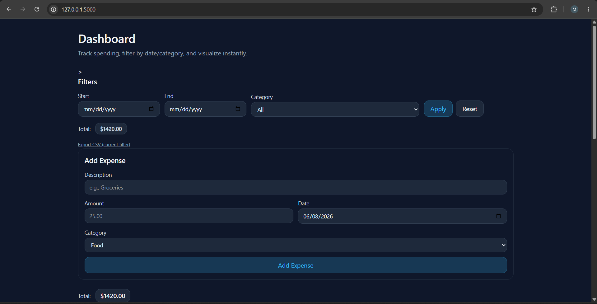
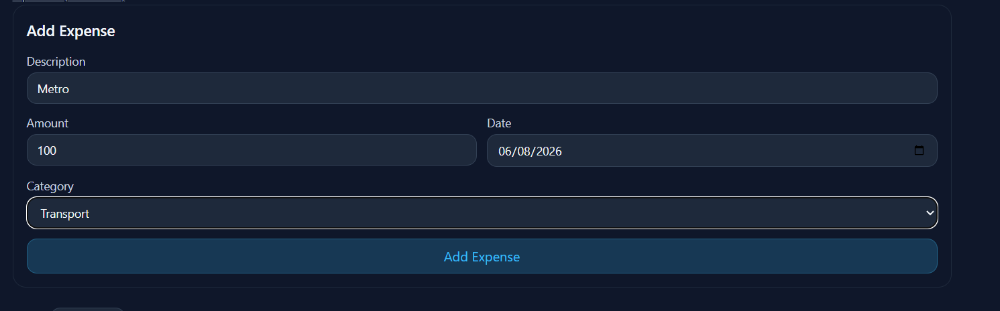
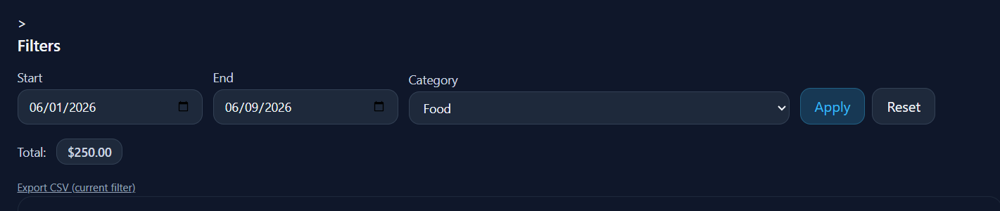
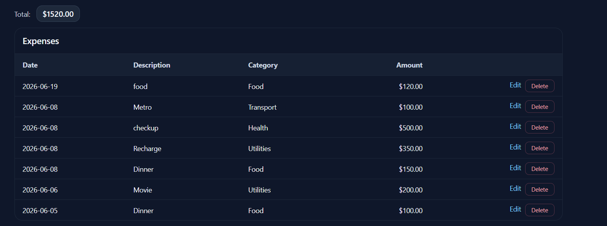
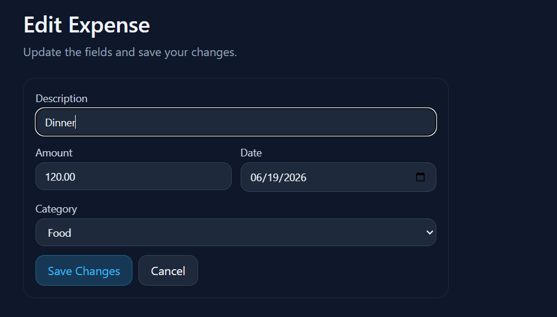
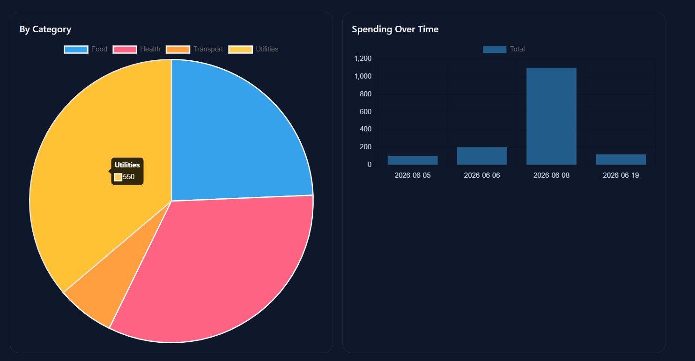

# Expense Tracker

A small Flask web app for tracking personal expenses and visualizing spending.

## Project Overview

This project lets you:
- Add expense entries with description, amount, category, and date
- Filter expenses by date range and category
- View total spending for the current filter
- See chart data for spending by category and spending over time
- Delete expense records
- Edit expense entries

The app stores data locally using SQLite (`expense.db`) and uses Flask + SQLAlchemy on the backend.

## Tech Stack

- Python
- Flask
- Flask-SQLAlchemy
- SQLite
- Jinja2 templates
- Tailwind CSS via CDN
- Chart.js for charts

## Setup

1. Create and activate your virtual environment:

```powershell
python -m venv venv
.\venv\Scripts\Activate.ps1
```

2. Install dependencies:

```powershell
pip install flask flask_sqlalchemy
```

3. Run the app:

```powershell
python app.py
```

4. Open the app in your browser:

```text
http://127.0.0.1:5000/
```

## Screenshots

You can add screenshots to this repository and reference them in the README like this:

```markdown






```
